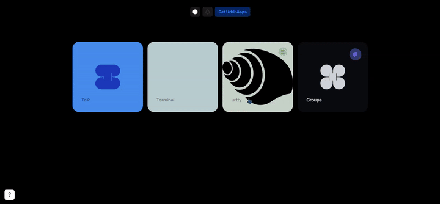

## `urtty`: PTY via `%lick`  

### Description

This is a repo with a collection of tools necessary to funnel a shell on a ship's host through a fakezod's %lick vane to allow shell access to the host via urbit webapp.

On init by the client urbit app, the backend app creates a shell process. Byte arrays are b64'd and wrapped in json, then passed from the process output into a unix socket in the pier directory. The urbit app uses `%lick` to pass data between the frontend and backend, and the frontend displays decoded data using `xterm.js`. Commands from the client are similarly encoded and passed to the backend, which passes them into the PTY session.

This repo contains a standalone Go script (`urtty-be/`) which will connect to the lick socket and generate PTY sessions; note however that the path is hardcoded to a fakezod in the root dir. Just replace the `sockPath` var in `main.go` to use another ship. 

### Security note

Urbit apps are not yet sandboxed! Don't install this on a ship with anything else installed.

### Usage

- Build the frontend: `./dev.sh`
- Install app: In your fakezod or other ship, `|new-desk %urtty`, `|mount %urtty`, copy the contents of `urtty-desk` into the mounted desk, then `|commit %urtty` and `|install our %urtty`
- Run the backend: `cd urtty-be && go run main.go`
- Log into ship, go to `/docket/upload`, select `urtty` desk and upload the `./web` directory